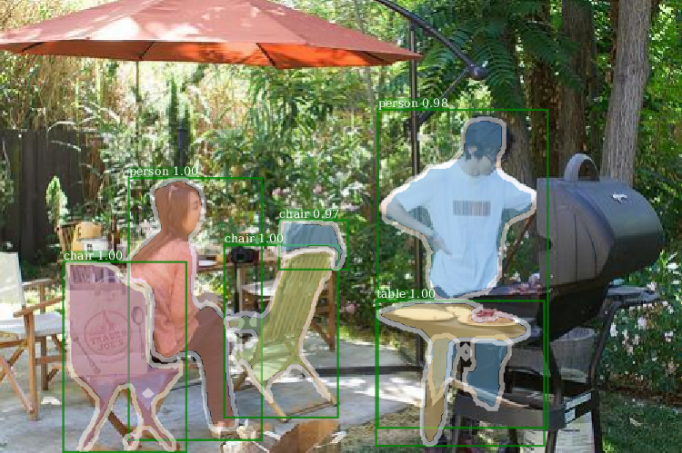

# Instruction for the Instance Segmentation Task

  

Scene Instance Segmentation is to segment an image into object instances. The task is pixel-wise classification similar to scene parsing, but it requires the proposed algorithm to extract object instances from the image as well. The motivation of this task is two folds: 1) Push the research of semantic segmentation towards instance segmentation; 2) Let there be more synergy among object detection, semantic segmentation, and the scene parsing. The data share semantic categories with scene parsing task, but comes with object instance annotations for 100 categories. The evaluation metric is Average Precision (AP) over all the 100 semantic categories.
* We encourage all participants of this task to take part in the COCO instance segmentation challenge as well.

## Data 

- Download the images [here](http://placeschallenge.csail.mit.edu/data/ChallengeData2017/images.tar). Note that Images are the same for all the three tasks in Places Challenge 2017.
- Download the instance segmentation annotations [here](http://placeschallenge.csail.mit.edu/data/ChallengeData2017/annotations_instance.tar). After untarring the data file, the directory structure should be similar to the following,

the training images:

    images/training/ADE_train_00000001.jpg
    images/training/ADE_train_00000002.jpg
        ...
        
the validation images:

    images/training/ADE_val_00000001.jpg
    images/training/ADE_val_00000002.jpg
        ...

the testing images:

    images/testing/ADE_test_00000001.jpg
        ...

the corresponding instance annotation masks for the training images and validation images:
    
    annotations_instance/training/ADE_train_00000001.png
    annotations_instance/training/ADE_train_00000002.png
        ...
        
    annotations_instance/validation/ADE_val_00000001.png
    annotations_instance/validation/ADE_val_00000002.png
        ...
        
In the instance annotation masks, the R(ed) channel encodes category ID, and the G(reen) channel encodes instance ID. Each object instance has a unique instance ID regardless of its category ID. 
In the dataset, all images have <256 object instances.

## Submission format

The submission file should be a single .json file containing all the predictions in RLE:

    [{
    "image_id" : int,   # IMPORTANT: image_id should match file_name according to imgCatIds.json
    "category_id" : int,
    "segmentation" : RLE,
    "score" : float,
    }]

## Evaluation routines
The performance of the instance segmentation algorithms will be evaluated by Average Precision (AP, or mAP), following COCO evaluation metrics.
For each image, we take at most 255 top-scoring instance masks across all categories.
For each instance mask prediction, we only count it when its IoU with ground truth is above a certain threshold. We take 10 IoU thresholds of 0.50:0.05:0.95 for evaluation. The final AP is averaged across 10 IoU thresholds and 100 categories.

You can refer to COCO evaluation page for more explanation: http://mscoco.org/dataset/#detections-eval

For everyone's reference, Mask-RCNN with FPN50 achieves 20.0 mAP on the validation set. We thank Kaiming He and Ross Girshick for their support.

To run the evaluation demo:

0. cd instancesegmentation/evaluation
1. Convert annotations of validation set (*.png) into RLE format (.json), by running convert_anns_to_json_dataset.py
2. Install COCO API: https://github.com/pdollar/coco
3. Prepare your results in the submission format (.json)
4. run eval_main.py

